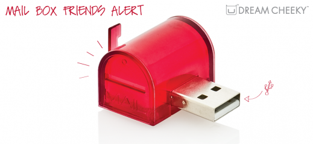

# PyUsbLamp
Mailbox Friends Alert (Dream Cheeky) Driver in Python.

## The Device
Basically, it is a RGB LED connected with USB. 

**Vendor ID:** `0x1d34`  
**Product ID:** `0x000a`



## Dependencies
pyusb

## Installation
1. For Linux only

    1. Install "libusb"
   
        E.g. `sudo apt-get install libusb-dev`
        
    2. Change device access right
        
        Add file, /etc/udev/rules.d/88-pyusblamp.rules, with the following content
        
        ```
        SUBSYSTEM=="usb", ATTR{idVendor}=="1d34", ATTR{idProduct}=="000a", MODE="0666"
        SUBSYSTEM=="usb", ATTR{idVendor}=="1d34", ATTR{idProduct}=="0004", MODE="0666"
        ```
   
2. Install PyUsbLamp
   
    1. Install from Pypi

        `pip install pyusblamp`
      
        or
      
    2. Install from GitHub

        `pip install git+https://github.com/onelife/PyUsbLamp.git`

